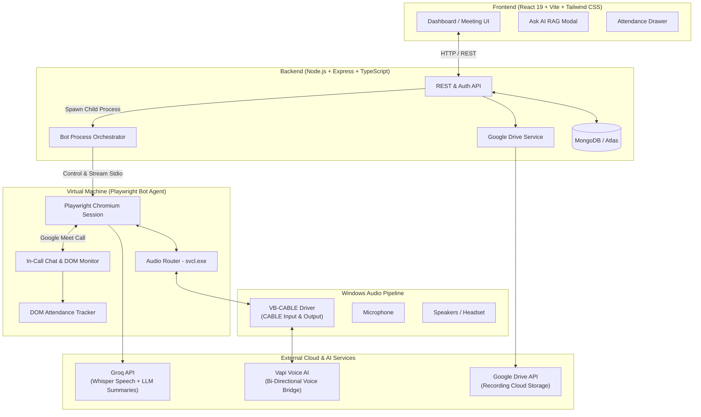

# MeetMinutes.ai 🎙️🤖

[](https://nodejs.org/)
[](https://react.dev/)
[](https://www.typescriptlang.org/)
[](https://playwright.dev/)
[](https://groq.com/)
[](https://www.mongodb.com/)
[](https://pytest.org/)

**MeetMinutes.ai** is an autonomous, conversational AI meeting agent engineered for Google Meet. It joins meetings with participant consent, interacts naturally via voice, streams real-time transcription with speaker identification, logs participant attendance analytics, generates structured post-meeting intelligence (summaries, decisions, action items), and provides an interactive Ask-AI knowledge retrieval system across your entire meeting history.

---

## 📑 Table of Contents

- [Key Features](#-key-features)
- [Architecture & Data Flow](#-architecture--data-flow)
- [Repository Structure](#-repository-structure)
- [Prerequisites](#-prerequisites)
- [Hardware & Audio Pipeline Setup](#-hardware--audio-pipeline-setup)
- [Installation](#-installation)
- [Configuration (.env)](#-configuration-env)
- [Google Account & Profile Setup](#-google-account--profile-setup)
- [Running Locally](#-running-locally)
- [Standalone Bot Execution](#-standalone-bot-execution)
- [Automated Testing Suite](#-automated-testing-suite)
- [Useful Development Scripts](#-useful-development-scripts)
- [Troubleshooting & FAQs](#-troubleshooting--faqs)
- [Security & Consent](#-security--consent)
- [License](#-license)

---

## ✨ Key Features

- **Live Conversational Google Meet Bot**: Joins scheduled or ad-hoc Google Meet calls through automated Chromium orchestration with persistent profiles and human-like interaction.
- **Two-Way Real-Time Voice Interaction**: Powered by Vapi and VB-CABLE virtual audio routing to both capture meeting audio and speak directly into the meeting room.
- **Speech-to-Text & Speaker Context**: Live transcription using Groq Whisper, associating spoken dialogue with attendee names, avatars, and roles.
- **AI Meeting Intelligence**: Automated extraction of meeting summaries, critical topics, key decisions, and actionable deliverables with assignees and deadlines (Groq LLM).
- **In-Call Attendance Tracking & Analytics**: Tracks attendee join/leave intervals, active speaking duration, and participation metrics, viewable in a live side-drawer.
- **Ask AI (Meeting Knowledge RAG)**: Ask contextual natural language questions grounded in current or past meeting transcripts.
- **Group Workspaces & Collaboration**: Organize meetings into project/team workspaces with role-based access control.
- **Multi-Format Export & Cloud Storage**: Export summaries as PDF reports, transcripts as text, and attendance as CSV. Optional automated upload of session recordings to Google Drive.

---

## 🏛 Architecture & Data Flow



---

## 📁 Repository Structure

```text
meeting-agent/
├── frontend/               # React 19 single-page dashboard (Vite, Tailwind CSS, Lucide)
│   ├── src/
│   │   ├── components/     # UI components (AttendanceDrawer, AskMeetingsModal, etc.)
│   │   ├── App.tsx         # Main application shell & router
│   │   └── index.css       # Design system & Tailwind styles
│   └── package.json
│
├── backend/                # Express API & bot orchestration server
│   ├── src/
│   │   ├── controllers/    # Auth, meeting, group, and audio controllers
│   │   ├── models/         # Mongoose schemas (User, Meeting, Group)
│   │   ├── routes/         # Express REST API endpoints
│   │   ├── services/       # Groq AI, Google Drive, and Process spawning services
│   │   └── scripts/        # Database initialization & verification scripts
│   └── package.json
│
├── virtual_machine/        # Playwright bot, audio routing, and Vapi bridge
│   ├── src/
│   │   ├── join-meeting.ts # Core Playwright automation & meeting lifecycle
│   │   ├── audio-routing.ts# Windows audio device management via svcl.exe
│   │   ├── profile.ts      # Google login persistent context helper
│   │   ├── vapi-bridge.ts  # Voice AI bridge connection
│   │   └── attendance-tracker.ts # In-call participant attendance monitor
│   ├── tools/
│   │   └── svcl.exe        # NirSoft SoundVolumeView x64 CLI (bundled)
│   ├── kill-chrome.js      # Emergency bot-specific Chrome cleanup tool
│   └── package.json
│
├── tests/                  # Automated Pytest + Selenium test suite (19 suites)
│   ├── conftest.py         # Pytest fixtures and browser setup
│   ├── test_*.py           # Test modules (unit, integration, NFR, UI, whitebox)
│   └── README.md           # Comprehensive test suite documentation
│
├── VBCABLE_Driver_Pack45/  # Bundled official VB-CABLE driver installer
├── scrrenshots/            # Visual test evidence and UI verification captures
└── pytest.ini              # Pytest configuration file
```

---

## 💻 Prerequisites

Ensure your host machine meets the following requirements:

1. **Operating System**: **Windows 10 / 11 (64-bit)** with an interactive desktop session (required for Windows Sound API and audio endpoint switching).
2. **Node.js**: `v20.0.0` or higher (`node -v`).
3. **Python**: `3.10` or higher with `pip` (required for running the test suite).
4. **Database**: Active **MongoDB** instance (local on `mongodb://localhost:27017` or a MongoDB Atlas cluster URI).
5. **API Keys**:
   - **Groq API Key**: Required for Whisper speech transcription and LLM minutes generation ([Groq Console](https://console.groq.com)).
   - **Vapi API Key & Assistant ID** *(Optional)*: Required for conversational voice interaction ([Vapi Dashboard](https://vapi.ai)).
   - **Google Cloud OAuth / Service Account** *(Optional)*: Required for Google Sign-In and Google Drive recording backup.

---

## 🔊 Hardware & Audio Pipeline Setup

The conversational bot requires bidirectional audio routing so it can listen to Meet audio and speak back without physical speaker feedback.

### 1. Install VB-CABLE Driver (Bundled)

The VB-CABLE driver is included directly in this repository:

1. Navigate to the bundled driver directory: `VBCABLE_Driver_Pack45\`.
2. Right-click **`VBCABLE_Setup_x64.exe`** and choose **Run as administrator**.
3. Click **Install Driver**.
4. **Restart your computer** when installation completes.
5. Verify in Windows Sound Settings:
   - Playback Devices: **CABLE Input (VB-Audio Virtual Cable)**
   - Recording Devices: **CABLE Output (VB-Audio Virtual Cable)**

### 2. Verify SoundVolumeView (`svcl.exe`)

The audio manager uses NirSoft's `svcl.exe` to inspect endpoints and safely toggle defaults between your physical hardware and VB-CABLE during calls.

- The 64-bit binary is **pre-installed** at:
  ```text
  virtual_machine\tools\svcl.exe
  ```
- If you prefer to place it elsewhere, set the `SVCL_PATH` environment variable pointing to its absolute path.

> [!NOTE]
> When the bot joins a call, it captures your current Windows audio defaults, switches playback/recording to VB-CABLE, and automatically restores your original physical microphone and speakers when the meeting concludes.

---

## 📦 Installation

Clone the repository and install dependencies for each component:

### 1. Frontend
```powershell
cd frontend
npm install
```

### 2. Backend
```powershell
cd ..\backend
npm install
```

### 3. Virtual Machine (Bot Agent)
```powershell
cd ..\virtual_machine
npm install
npx playwright install chromium
```

### 4. Test Suite (Python)
From the project root:
```powershell
cd ..
pip install pytest selenium requests
```

---

## ⚙️ Configuration (.env)

Create and populate the `.env` files for each layer:

### Backend (`backend/.env`)

```powershell
Copy-Item backend\.env.example backend\.env
```

| Variable | Description | Example / Default |
|---|---|---|
| `PORT` | API Server Port | `3001` |
| `MONGODB_URI` | MongoDB Connection URI | `mongodb://localhost:27017/meeting-agent` |
| `JWT_SECRET` | Secret key for JWT signing | `your_strong_jwt_secret` |
| `JWT_EXPIRES_IN` | Token expiration period | `7d` |
| `GROQ_API_KEY` | Groq API Key for LLM summarization | `gsk_...` |
| `GOOGLE_CLIENT_ID` | Google OAuth Web Client ID | *(Optional)* |
| `GOOGLE_APPLICATION_CREDENTIALS` | Path to Drive Service Account JSON | *(Optional)* |
| `GOOGLE_DRIVE_FOLDER_ID` | Target Google Drive folder ID | *(Optional)* |

### Virtual Machine (`virtual_machine/.env`)

```env
# Groq API for local transcript processing
GROQ_API_KEY=gsk_...
GROQ_MODEL=llama-3.3-70b-versatile

# Vapi Voice Assistant (leave blank or use NO_VAPI=1 to disable)
VAPI_PRIVATE_KEY=your_vapi_private_key
VAPI_ASSISTANT_ID=your_vapi_assistant_id

# Audio & Device Overrides (Optional)
CABLE_INPUT_NAME="CABLE Input"
CABLE_OUTPUT_NAME="CABLE Output"
SVCL_PATH="tools\svcl.exe"
BRIDGE_PORT=4711
```

### Frontend (`frontend/.env`)

```powershell
Copy-Item frontend\.env.example frontend\.env
```

```env
VITE_GOOGLE_CLIENT_ID=your_google_client_id.apps.googleusercontent.com
```

---

## 🔑 Google Account & Profile Setup

Google Meet often requires participants to be logged in to bypass restrictive host admission policies. The bot utilizes a persistent browser profile located at `virtual_machine\profiles\meet`.

Run the automated profile initialization command:

```powershell
cd virtual_machine
npm run profile
```

1. A dedicated Chrome browser will open at `https://accounts.google.com`.
2. Sign in with the Google Account you wish the bot to use.
3. Close the Chrome window once logged in.
4. Your authenticated cookies and session are preserved locally in `virtual_machine\profiles\meet` and will be reused for subsequent meetings.

> [!CAUTION]
> Never commit `virtual_machine/profiles/` or session credentials into version control. They are protected in `.gitignore`.

---

## 🚀 Running Locally

### 1. Initialize Database
Initialize default collections and indexes:
```powershell
cd backend
npm run db:init
```

### 2. Start the Backend API Server
```powershell
cd backend
npm run dev
# Server will start on http://localhost:3001
```

### 3. Start the Frontend Dashboard
In a new terminal window:
```powershell
cd frontend
npm run dev
# Dashboard available at http://localhost:5173
```

Open `http://localhost:5173` in your browser. From the dashboard, enter any Google Meet URL, approve the consent prompt, and click **Send Agent to Meet**.

---

## 🤖 Standalone Bot Execution

The bot can also be invoked directly from the CLI without launching the web dashboard:

```powershell
cd virtual_machine
npm start -- --url "https://meet.google.com/abc-defg-hij" --name "MeetMinutes AI Agent"
```

### Supported CLI Flags

| Flag | Shorthand | Description |
|---|---|---|
| `--url <link>` | `-u` | Target Google Meet meeting URL |
| `--name <name>` | `-n` | Display name of the bot agent inside the call |
| `--profile <dir>` | `-p` | Path to custom persistent Chrome profile |
| `--svcl <path>` | | Custom path to `svcl.exe` |
| `--no-vapi` | | Run in transcription-only mode without Vapi voice synthesis |

---

## 🧪 Automated Testing Suite

The project includes an extensive Selenium and Pytest automated testing suite comprising **19 test suites and 70+ test cases** covering unit, integration, UI, resilience, and non-functional requirements.

### Running the Test Suite

```powershell
# Run the entire test suite
pytest

# Run tests with verbose output
pytest -v

# Run tests with a visible browser window (headed mode)
pytest tests/test_integration_requirements.py -v --headed

# Run specific functional suites
pytest tests/test_storage_resilience.py -v
pytest tests/test_meeting_url_lifecycle.py -v
pytest tests/test_meeting_summarization.py -v
pytest tests/test_non_functional_requirements.py -v
```

For detailed breakdown, assertions, and test specifications, refer to [tests/README.md](file:///c:/Users/MY%20PC/Documents/VS%20code/Projects/meeting-agent/tests/README.md).

---

## 🛠 Useful Development Scripts

| Command | Working Directory | Purpose |
|---|---|---|
| `npm run profile` | `virtual_machine` | Opens persistent Chrome to log in to Google Meet |
| `npm run typecheck` | `backend` / `virtual_machine` | Runs TypeScript compilation verification (`tsc --noEmit`) |
| `npm run lint` | `frontend` | Runs ESLint across frontend components |
| `npm run build` | `frontend` / `backend` | Builds production bundles |
| `npm run db:init` | `backend` | Seeds and initializes MongoDB collections |
| `tsx src/scripts/get-drive-token.ts` | `backend` | Generates OAuth2 refresh tokens for Google Drive |
| `cscript //nologo kill-chrome.js` | `virtual_machine` | Terminates only dangling meeting-agent Chrome instances |

---

## ❓ Troubleshooting & FAQs

### 1. `VB-Cable not found` Error
- **Cause**: Windows cannot detect the virtual audio driver endpoints.
- **Fix**: Open Windows Device Manager $\rightarrow$ Sound, video and game controllers. Ensure "VB-Audio Virtual Cable" is listed. If missing, run `VBCABLE_Driver_Pack45\VBCABLE_Setup_x64.exe` as Administrator and reboot.

### 2. Bot Stuck at "Asking to join..."
- **Cause**: Google Meet requires the meeting host to admit external or unauthenticated participants.
- **Fix**: Run `npm run profile` in `virtual_machine` and sign in with an account belonging to the meeting's Google Workspace organization, or admit the bot from the host screen.

### 3. Lingering Chrome Processes Lock Profile
- **Cause**: An interrupted test or crashed session left background Chrome instances holding `profiles/meet/Default/Preferences`.
- **Fix**: Run the cleanup script from `virtual_machine`:
  ```powershell
  cscript //nologo kill-chrome.js
  ```

### 4. Audio Defaults Not Restored After Meeting
- **Cause**: Script was terminated abruptly (e.g. `SIGKILL`) before cleanup hooks executed.
- **Fix**: Open Windows Sound Settings and manually select your physical speakers/headphones and microphone as Default Devices.

---

## 🔒 Security & Consent

- **Participant Consent**: The agent enforces a mandatory in-call disclosure notice and web UI consent modal prior to joining any meeting room.
- **Credential Safety**: Authentication tokens are hashed using `bcryptjs` and verified using stateless `jsonwebtoken` (JWT).
- **Environment Isolation**: All credentials, database URIs, API keys, and session cookies are strictly excluded from git tracking.
- **Network Encryption**: All external AI and database communications enforce TLS 1.3 encryption.

---

## 📄 License

This project is licensed under the MIT License. See [LICENSE](file:///c:/Users/MY%20PC/Documents/VS%20code/Projects/meeting-agent/LICENSE) for details.
